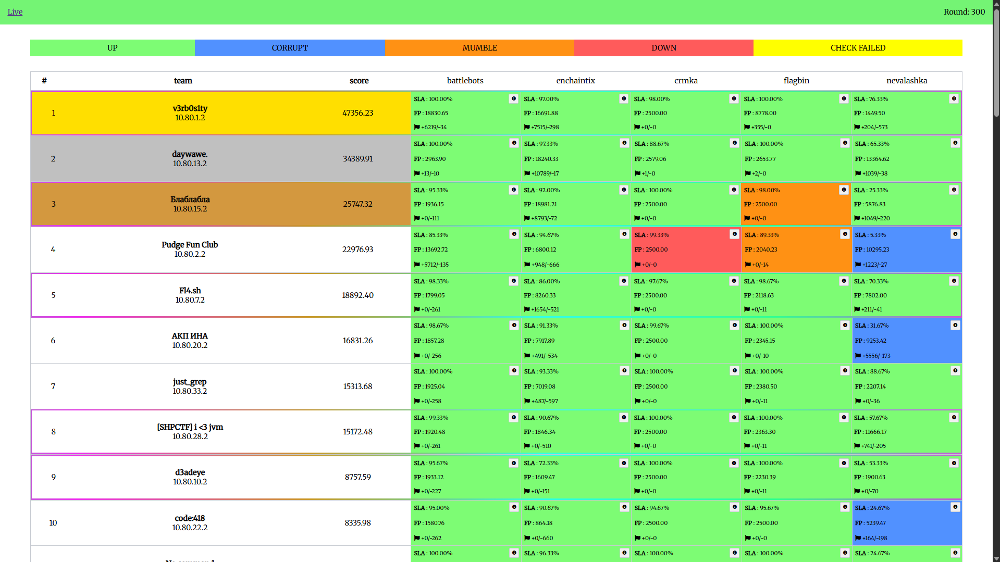

# AD Training 16.07.2025

Attack-Defense CTF training for high-school students, which was developed by members of [dtl](https://ctftime.org/team/157017) and [Rop Runners](https://ctftime.org/team/279418) teams.

## Services

| Service                             | Language   | Vulns | Authors |
| ----------------------------------- | ---------- | ----- | ------- |
| [battlebots](/services/battlebots/) | C          | got rw via integer overflow; overwrite printf to scanf; rop to system | [@FlexMaster420](https://t.me/FlexMaster420) |
| [crmka](/services/crmka/)           | JavaScript | ...   | ...     |
| [enchaintix](/services/enchaintix/) | Python     | ...   | ...     |
| [flagbin](/services/flagbin/)       | C          | path traversal via retrieve flag; read maps - ../../proc/self/maps; read mem - ../../proc/self/mem | [@FlexMaster420](https://t.me/FlexMaster420) |
| [nevalashka](/services/nevalashka/) | PHP        | ...   | ...     |

## Infrastructure

- DevOps: [@LeKSuS](https://github.com/LeKSuS-04)
- Checksystem: [ForcAD](https://github.com/pomo-mondreganto/ForcAD)

## Writeups

- [battlebots](/sploits/battlebots/)
- [crmka](/sploits/crmka/)
- [enchaintix](/sploits/enchaintix/)
- [flagbin](/sploits/flagbin/)
- [nevalashka](/sploits/nevalashka/)
